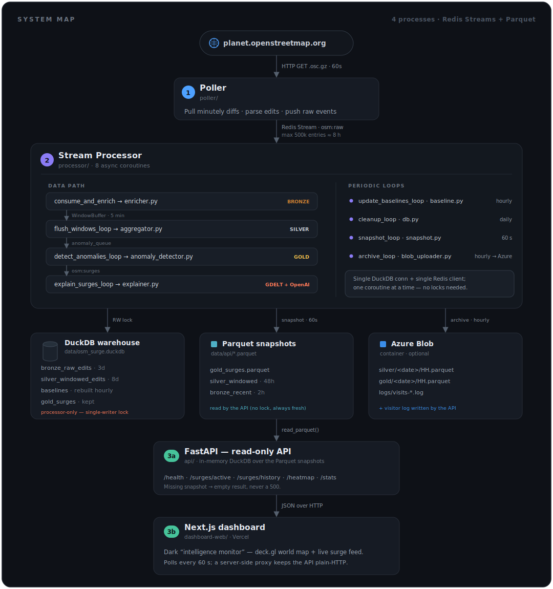

# OSM Surge Tracker — Architecture & Code Flow

Four components make up the system. Components 1–2 ingest and process OSM edits;
Components 3a–3b expose the results. They run as independent processes and
communicate through Redis Streams (ingest path) and Parquet snapshots (serving path).

---

## System Map



<details>
<summary>Text version (ASCII)</summary>

```
planet.openstreetmap.org
        │  HTTP GET .osc.gz every 60 s
        ▼
┌─────────────────────┐
│   COMPONENT 1       │  poller/
│   Poller            │  Pulls OSM minutely diffs, parses edits,
│                     │  writes raw events → Redis Stream osm:raw
└──────────┬──────────┘
           │  Redis Stream  osm:raw  (max 500,000 entries ≈ 8 h)
           ▼
┌─────────────────────────────────────────────────────────────┐
│   COMPONENT 2 — Stream Processor                            │  processor/
│                                                             │
│  consume_and_enrich ──► enricher.py   Bronze layer          │
│         │                                                   │
│         ▼                                                   │
│  WindowBuffer (in-memory) ──► aggregator.py                 │
│         │  every 5 min                                      │
│         ▼                                                   │
│  flush_windows_loop ──► Silver layer                        │
│         │                                                   │
│         ▼  anomaly_queue (asyncio.Queue)                    │
│  detect_anomalies_loop ──► anomaly_detector.py  Gold layer  │
│         │                                                   │
│         ▼  osm:surges Redis Stream                          │
│  explain_surges_loop ──► explainer.py                       │
│                                                             │
│  update_baselines_loop ──► baseline.py      (hourly)        │
│  cleanup_loop          ──► db.py            (daily)         │
│  snapshot_loop         ──► snapshot.py      (every 60 s)    │
│  archive_loop          ──► blob_uploader.py (hourly→Azure)  │
└─────────────────────────────────────────────────────────────┘
           │                       │                        │
           ▼                       ▼                        ▼
    data/osm_surge.duckdb     data/api/*.parquet       Azure Blob container
    ├── bronze_raw_edits (3d) ├── gold_surges.parquet  ├── silver/<date>/HH.parquet
    ├── silver_windowed  (8d) ├── silver_…  (48h)       ├── gold/<date>/HH.parquet
    ├── baselines              └── bronze_recent (2h)    └── logs/visits-….log
    └── gold_surges                    │                     (visitor log, from API)
                                       ▼
┌─────────────────────────────────────────────────────────────┐
│   COMPONENT 3a — FastAPI (read-only API)                    │  api/
│   Queries the Parquet snapshots via an in-memory DuckDB.    │
│   /health  /surges/active  /surges/history  /heatmap  /stats │
└──────────────────────────────┬──────────────────────────────┘
                               │  JSON over HTTP
                               ▼
┌─────────────────────────────────────────────────────────────┐
│   COMPONENT 3b — Next.js dashboard                          │  dashboard-web/
│   Dark "intelligence monitor" UI: deck.gl world map +       │
│   live surge feed. Polls the API every 60 s.                │
│   A server-side proxy route forwards browser calls to the   │
│   API, so the API can stay plain-HTTP. Hosted free on       │
│   Vercel (or any Node host).                                │
└─────────────────────────────────────────────────────────────┘
```

</details>

> **Why Parquet snapshots instead of reading the DuckDB file directly?**
> DuckDB allows only **one process** to hold a database file open in read-write
> mode. The processor holds that lock for its entire lifetime, so the API — a
> separate process — cannot open the same file, *not even read-only*. The fix:
> the processor (the lock holder) exports the tables the API needs to Parquet
> every 60 s, and the API reads those Parquet files with its own in-memory DuckDB.
> Parquet reads take no lock, are always fresh, and any number of API workers can
> read concurrently. See [Component 3 — Serving Layer](#component-3--serving-layer-api--dashboard).

---

## Component 1 — Poller (`poller/`)

Runs as a blocking loop (`time.sleep`). No asyncio. Fully independent of Component 2.

### Files

#### `poller.py` — entry point and polling loop

Owns the outer loop: fetch remote sequence number → download missing diffs → push to Redis → sleep 60 s.

- On first run: reads the current remote sequence from `planet.openstreetmap.org/replication/minute/state.txt` and writes it to `state.txt`. Editing starts from the *next* minute (no historical backfill).
- On restart: reads `state.txt` and catches up from where it left off. Because `state.txt` is updated after *each* sequence (not each loop), crash recovery is fine-grained — at most one minutely diff is reprocessed. If the gap exceeds `MAX_CATCHUP` (60 diffs ≈ 1 h), the stale history is skipped and polling resumes near the live head — the dashboard only serves recent data, so replaying a long backlog after downtime would just flood the pipeline with stale edits no query window sees.
- 404 responses are skipped silently (OSM sometimes has gaps in sequence numbers).
- All other errors log the traceback and retry after `POLL_INTERVAL = 60 s`.

**Calls:** `osm_parser.parse_osc_bytes` → `RedisProducer.push_events`

**State:** `poller/state.txt` (plain-text integer, overwritten after every sequence)

**Env vars:** `REDIS_HOST` (default `localhost`), `REDIS_PORT` (default `6379`)

---

#### `osm_parser.py` — `.osc.gz` parser

Converts raw gzip bytes downloaded from OSM into a flat list of Python dicts.

Uses `pyosmium` (`osmium.SimpleHandler`) which is a C-backed XML parser — it requires a file path, not a buffer. The workaround: decompress the gzip in Python, write decompressed XML to a temp file, call `apply_file`, then delete the temp file.

**Three callbacks** on `OSMChangeHandler`:
- `node(n)` — emits an event with `lat`/`lon` when the node has a valid location
- `way(w)` — emits an event with `lat=None, lon=None` (ways only store node references, not coords)
- `relation(r)` — same as way

**Action detection** (`_action`):
- `obj.deleted == True` → `"delete"`
- `obj.version == 1` → `"create"`
- otherwise → `"modify"`

**Output shape** (one dict per OSM element):
```
event_id        UUID string
sequence_number int — which minutely file this came from
timestamp       "2026-06-14T10:31:45Z"
edit_type       "create" | "modify" | "delete"
osm_type        "node" | "way" | "relation"
osm_id          int
lat             float | None
lon             float | None
changeset_id    int
user            str
tags            dict  e.g. {"amenity": "hospital"}
```

---

#### `redis_producer.py` — Redis Stream writer

`RedisProducer.push_events` takes the list of dicts from the parser and batches them into a single Redis pipeline (`XADD` × N, `transaction=False`).

**Serialization rules** (Redis stores everything as strings):
- `None` → `"null"`
- `dict` / `list` → `json.dumps(...)`
- everything else → `str(...)`

**Stream key:** `osm:raw`
**Max length:** 500,000 entries (approximate trimming — O(1) per add, may slightly exceed the cap)

---

## Component 2 — Stream Processor (`processor/`)

Runs as a single `asyncio` event loop with **eight** coroutines active simultaneously. Because asyncio is **single-threaded cooperative multitasking**, there is no true concurrency — coroutines yield to each other at every `await`. This means:

- The single DuckDB connection and the single Redis client are accessed by only one coroutine at a time. No locking needed.
- `WindowBuffer.add_event` and `WindowBuffer.flush` contain no `await` calls, so they run atomically.

> **Keeping the loop free.** One rule matters for responsiveness: a synchronous,
> CPU-bound call inside a coroutine blocks *every* other coroutine until it returns.
> The reverse-geocoder lookup is exactly such a call, so it is offloaded with
> `await asyncio.to_thread(rg.search, …)` (see `enricher.py`), and the geocoder's
> one-time database load is pre-warmed before `asyncio.gather` (see `processor.py`).
> Without this, a geocoding pause would stall the explainer's HTTP calls long enough
> to trip their timeouts.

**Entry point:** `python processor.py` (auto-loads `../secret.env` via python-dotenv)

### File dependency graph

```
processor.py
├── db.py                  (DuckDB connection + all table DDL)
├── redis_consumer.py      (stream/group constants, xreadgroup wrapper)
├── enricher.py
│   └── db.py              (insert_bronze_batch)
│   └── redis_consumer.py  (STREAM_ENRICHED constant)
├── aggregator.py
│   └── db.py              (executemany into silver table)
├── baseline.py
│   └── db.py              (SELECT from silver, INSERT into baselines)
├── anomaly_detector.py
│   └── db.py              (get_baseline, get_global_95th_percentile, INSERT gold)
│   └── enricher.py        (COUNTRY_NAMES dict)
│   └── redis_consumer.py  (STREAM_SURGES constant)
├── explainer.py
│   └── db.py              (UPDATE gold_surges)
│   └── redis_consumer.py  (read_messages, ack_message, GROUP_EXPLAINER)
├── snapshot.py           (COPY gold/silver/bronze → data/api/*.parquet)
├── blob_uploader.py      (hourly COPY silver/gold slice → Azure Blob; no-op if unconfigured)
│   └── timeutil.py       (now_ist() for hour-boundary alignment)
└── timeutil.py           (IST timezone helpers — now_ist())
```

---

### Timezone convention (IST)

Every timestamp the processor **writes to DuckDB** is a *naive* datetime holding
**IST (UTC+5:30) wall-clock** time. This is deliberate and machine-independent:
`processor/timeutil.py` exposes `now_ist()` (= `datetime.now(IST).replace(tzinfo=None)`),
and all stored-timestamp call sites use it instead of `datetime.now(timezone.utc)`.

- **Why naive IST, not UTC?** DuckDB `TIMESTAMP` columns drop tzinfo. Relying on
  `datetime.now(timezone.utc)` + DuckDB's implicit host-timezone conversion produced
  values that depended on the host's clock and were then mislabelled UTC by the API.
  Computing IST explicitly makes stored values correct and identical on any host.
- **SQL that filters these columns** uses the matching naive-IST "now":
  `NOW() AT TIME ZONE 'Asia/Kolkata'` (e.g. in `baseline.py`, `db.cleanup_old_records`,
  `snapshot.py`). The API computes naive-IST cutoffs in Python (`api/timeutil.now_ist`)
  and binds them as `?` parameters.
- **The API serialises** these naive values with the IST offset (`+05:30`) via a
  Pydantic validator, so clients receive correctly-labelled timestamps.
- The raw OSM edit `timestamp` in `bronze_raw_edits` is the authoritative UTC value
  from OSM and is left as-is (it is not used in any time-window filter).

---

### Files

#### `db.py` — DuckDB foundation

Everything that touches the database goes through here. All other modules import from `db.py` — none of them open their own connections.

**`get_connection()`** — creates `data/osm_surge.duckdb` (and the `data/` directory) if they don't exist.

**`create_tables(conn)`** — idempotent (`CREATE TABLE IF NOT EXISTS`). Creates:

| Table | Layer | Purpose |
|---|---|---|
| `bronze_raw_edits` | Bronze | One row per raw OSM edit event, enriched with geo labels |
| `silver_windowed_edits` | Silver | One row per region per 5-minute window |
| `baselines` | — | Rolling 7-day per-region-per-hour averages |
| `gold_surges` | Gold | Confirmed surge events with explanation |

Also creates `idx_baselines` index on `(country_code, admin_region, hour_of_day)` to speed up the per-event baseline lookup during anomaly detection.

**`get_baseline(conn, country_code, admin_region, hour_of_day)`** — point lookup against the baselines table. Returns `{baseline_mean, baseline_std, sample_count}` or `None`. Converts SQL `NULL` std (returned by `STDDEV` when there is only one sample) to `0.0`.

**`get_global_95th_percentile(conn, min_unique_users)`** — `PERCENTILE_CONT(0.95)` over silver `edit_count` values, restricted to windows with `unique_users >= min_unique_users` (the detector passes its own `MIN_UNIQUE_USERS=3`). Excluding single-account bulk imports — which are never surges — keeps their huge volumes from inflating the cold-start threshold and masking genuine surges. Returns `50.0` when no qualifying window exists (cold-start sentinel).

**`cleanup_old_records(conn)`** — deletes bronze rows older than 30 days, silver rows older than 90 days. Called by `cleanup_loop` in `processor.py` once per 24 hours.

---

#### `redis_consumer.py` — Redis Stream helpers

Defines all stream/group name constants used across the codebase:

```
STREAM_RAW      = "osm:raw"        written by Component 1
STREAM_ENRICHED = "osm:enriched"   written by enricher.py
STREAM_SURGES   = "osm:surges"     written by anomaly_detector.py, read by explainer.py
GROUP_PROCESSOR = "processor-group"
GROUP_EXPLAINER = "explainer-group"
```

**`setup_consumer_group`** — `XGROUP CREATE` with `mkstream=True` (creates the stream key if it doesn't exist yet, so the processor can start before the poller). Swallows `BUSYGROUP` errors on restart.

**`read_messages`** — wraps `XREADGROUP`. Returns a flat `list[tuple[msg_id, fields_dict]]`. Returns `[]` on timeout (normal when the stream is quiet). The `">"` cursor means "give me only messages no other consumer in this group has seen yet."

**`ack_message`** — `XACK`. Called only after a message has been fully processed (DuckDB write confirmed). This gives at-least-once delivery: if the processor crashes before ACKing, Redis re-delivers the message on the next `XREADGROUP` call.

**Redis client configuration:** `decode_responses=True` is set on the client in `processor.py` and passed to all functions. This means field keys and values arrive as Python `str`, not `bytes`, matching the serialization convention used by the poller.

---

#### `enricher.py` — deserialisation + geocoding + Bronze layer

This module handles the first transformation of raw Redis data into usable Python objects.

**`deserialize_raw_fields(fields)`** — reverses the poller's serialization:

| Redis string | Python type | How |
|---|---|---|
| `"null"` | `None` | `json.loads("null")` |
| `"51.506"` | `51.506` (float) | `json.loads("51.506")` |
| `'{"amenity":"hospital"}'` | `dict` | `json.loads(...)` |
| `"2026-06-14T10:31:45Z"` | `datetime` (UTC-aware) | `.replace("Z", "+00:00")` then `fromisoformat` |
| `"123"` | `int` | `int(...)` |

**`enrich_batch(events)`** (async) — calls `_reverse_geocode_batch` then adds `has_coords`, `processed_at` (naive IST, via `now_ist()`), and four geo fields to each event dict.

**`_reverse_geocode_batch`** (async) — collects all valid `(lat, lon)` pairs, then calls `await asyncio.to_thread(rg.search, coord_pairs, mode=1)` **once** for the whole batch (reverse_geocoder supports batch lookups — one library call is far cheaper than N calls). The `to_thread` offload keeps this CPU-bound call off the event loop. Results are mapped back by list index. Invalid / missing coordinates produce `None` geo fields.

`rg.search` returns `[{"cc": "IN", "name": "Bengaluru", "admin1": "Karnataka"}, ...]`. These map to:
- `cc` → `country_code`
- `admin1` → `admin_region`
- `name` → `place_name`
- `COUNTRY_NAMES[cc]` → `country_name` (a dict of ~50 ISO codes → human-readable names; falls back to the code itself)

**`insert_bronze_batch(conn, enriched)`** — `conn.executemany()` — bulk insert into `bronze_raw_edits`. `tags` is re-serialized to a JSON string for DuckDB's `JSON` column type.

**`push_enriched_to_redis(redis_client, enriched)`** — pipelined `XADD` to `osm:enriched` (maxlen 100,000). Uses the same serialization convention as the poller (`None → "null"`, `dict → json.dumps`, `datetime → strftime`).

---

#### `aggregator.py` — in-memory accumulation + Silver layer

**`WindowBuffer`** — the core in-memory accumulator. Holds one bucket per `(country_code, admin_region)` pair within the current 5-minute window.

Each bucket tracks:
```
edit_count      running total
unique_users    set of usernames (deduplicated)
edit_types      Counter: how many creates / modifies / deletes
osm_types       Counter: how many nodes / ways / relations
tag_keys        Counter: how many times each tag key appeared (e.g. "building": 45)
building_count  events that had a "building" tag key
highway_count   events that had a "highway" tag key
sample_lats     up to 10 latitudes (for centroid, bounded to keep memory constant)
sample_lons     up to 10 longitudes
```

**`add_event(event)`** — routes one enriched event to the correct bucket. No I/O. No `await`. Runs atomically from asyncio's perspective.

**`flush(conn, window_start, window_end)`** — called every 5 minutes by `flush_windows_loop`:
1. Computes derived metrics per bucket: `pct_creates`, `pct_building`, `pct_highway`, `dominant_tag` (the most-common tag key), `centroid_lat/lon` (mean of up to 10 samples)
2. Bulk-inserts all buckets into `silver_windowed_edits` via `executemany`
3. Resets `_buckets` to an empty `defaultdict`
4. Returns the list of silver record dicts (passed to `detect_anomalies_loop` via the queue)

**`get_current_window()`** — returns the calendar-aligned 5-minute window containing `now_ist()` (naive IST). Uses integer floor division then `timedelta` addition so hour/day rollovers are handled correctly by Python's datetime arithmetic.

---

#### `baseline.py` — rolling 7-day baseline (hourly coroutine)

**`update_baselines_loop(conn)`** — runs forever: recalculate, sleep 1 hour, repeat.

**`_recalculate_baselines(conn)`** — runs inside a transaction:
1. `DELETE FROM baselines` (full replace, not upsert)
2. `INSERT INTO baselines SELECT ... FROM silver_windowed_edits WHERE window_start >= (NOW() AT TIME ZONE 'Asia/Kolkata') - INTERVAL '7 days'` — the IST "now" matches the naive-IST `window_start` values

The query groups by `(country_code, admin_region, hour_of_day)` and computes `AVG` and `STDDEV` of `edit_count`. The hour-of-day grouping is critical: OSM editing follows global day/night patterns, so comparing Karnataka at 2 am against Karnataka at 2 am (not against the daily average) prevents false positives.

`STDDEV` returns `NULL` when a group has only one data point. `db.get_baseline` converts this to `0.0`; `anomaly_detector` then uses `max(std, 1.0)` as the denominator floor.

---

#### `anomaly_detector.py` — Z-score detection + Gold layer

Receives batches of silver records from `anomaly_queue` (put there by `flush_windows_loop` after every 5-minute flush).

**`_detect_surge(conn, redis_client, silver_record)`:**

**Precondition (both paths):** `unique_users >= 3` (`MIN_UNIQUE_USERS`). The data showed
most high-volume windows are a single/paired account doing thousands of edits — a bulk
import or a lone mapper, not a newsworthy event — so windows with fewer than 3 distinct
mappers are never counted as surges (not written to gold at all).

**Normal path** (baseline has ≥ 10 samples):
```
z_score       = (edit_count − baseline_mean) / max(baseline_std, 1.0)
surge_magnitude = edit_count / max(baseline_mean, 1.0)
is_surge      = z_score > 4.0
              AND surge_magnitude > 10.0
              AND edit_count > 1000
```

Conditions required simultaneously to prevent false positives:
- `unique_users >= 3` (`MIN_UNIQUE_USERS`) — excludes single-account bulk imports
- `z_score > 4.0` (`ZSCORE_THRESHOLD`) — statistically unusual
- `surge_magnitude > 10.0` (`MAGNITUDE_THRESHOLD`) — at least 10× above baseline volume
- `edit_count > 1000` (`MIN_EDIT_COUNT`) — a real, baseline-independent absolute floor

**Cold-start path** (baseline missing or fewer than 10 samples):
```
is_surge = edit_count > global_p95 × 2  AND  edit_count > 1000  AND  surge_magnitude > 10.0
```
(the `unique_users >= 3` precondition applies here too). `z_score` is set to `-1.0` as a
sentinel so downstream code can tell this was a cold-start detection.

**On surge:**
1. INSERT into `gold_surges` with `detected_at = now_ist()` (naive IST), `status="active"`, blank `explanation`, empty `news_headlines`
2. `XADD` to `osm:surges` stream with all fields the explainer needs (surge_id, location, magnitude, dominant tag, etc.); timestamps are labelled `+05:30`

Null-coord buckets (`country_code=None`) are skipped — they have no geographic identity to report.

---

#### `explainer.py` — GDELT + OpenAI enrichment

Reads from `osm:surges` using its own consumer group (`explainer-group`). Creates one `aiohttp.ClientSession` and one `openai.AsyncOpenAI` instance for the lifetime of the process. The OpenAI client is built with an explicit `timeout=30.0` and `max_retries=2`.

News comes from the **GDELT Cloud Events API** (`gdeltcloud.com/api/v2/events`). Every event is geolocated, so we query by the surge **centroid** (`near` + `radius_km`) over the surge's date window and read the source articles GDELT links to each event — a much better geographic fit than free-text search for a localized mapping surge. Requires an API key in the **`GDELT_API_KEY`** env var (sign up at gdeltcloud.com); if unset, surges are still recorded, just without news.

**Concurrency cap.** A window flush can emit several surges at once. Firing a GDELT + OpenAI call for each concurrently created a thundering herd that exhausted connections and timed out, so a module-level `asyncio.Semaphore(3)` limits the external API calls to **3 surges in flight at a time**; the DuckDB write and ACK happen outside the semaphore.

**GDELT pacer.** GDELT Cloud enforces plan-based quotas (HTTP 429 `RATE_LIMITED`). A dedicated module-level `asyncio.Lock` (`_GDELT_LOCK`) plus a `time.monotonic()` timestamp serialises GDELT calls and spaces them ≥ `GDELT_MIN_INTERVAL` (1 s) apart, independent of the OpenAI semaphore, to avoid bursting the quota.

**`_fetch_news(session, surge)`** — reads `GDELT_API_KEY` (returns `[]` if unset), parses the surge centroid, derives the date window (`_date_window`: the surge day and the 2 days before), and calls `_query_events`.

**`_query_events(session, api_key, lat, lon, date_start, date_end)`** — async GET to the Events endpoint with `Authorization: Bearer <key>` and params `near=lat,lon`, `radius_km=50`, `date_start`, `date_end`, `sort=recent`, `limit=5` (30 s timeout), run under the pacer lock. Parses defensively (non-200 / non-JSON → `[]`). Walks each event's `top_articles` and maps them to `{title, url, publishedAt}` (from `article_date`), deduped by URL and capped at 5 — the **same shape** stored in `news_headlines`, so nothing downstream (`api/models.py`, the dashboard) changes.

**`_generate_explanation(openai_client, surge_data, headlines)`** — builds a prompt with the surge's location, time, magnitude, tag breakdown, and the news headlines. Calls `gpt-4o-mini` with `max_tokens=100`. Returns the response string, or `""` on failure.

**`_enrich_surge`** — runs the two external calls under the shared semaphore, then `UPDATE gold_surges SET explanation=?, news_headlines=? WHERE surge_id=?`. The Redis `XACK` fires only after the DuckDB update succeeds. If GDELT or OpenAI fail, the surge stays in the gold table with empty fields — it is never lost.

All three operations (GDELT, OpenAI, DuckDB) are wrapped in separate `try/except` blocks so a failure in one does not prevent the others.

---

#### `processor.py` — main asyncio event loop

Startup sequence (order matters):
1. `load_dotenv("../secret.env")` — load optional keys/config (no-op if the file is absent)
2. Connect to Redis — abort immediately if unreachable
3. Open DuckDB connection, create all tables
4. `setup_consumer_group` for both `processor-group` (on `osm:raw`) and `explainer-group` (on `osm:surges`)
5. **Pre-warm the geocoder** — `await asyncio.to_thread(rg.search, [(0.0, 0.0)], mode=1)` so the one-time ~2.4M-city load happens visibly here (in a thread) rather than silently stalling the first message batch
6. Instantiate shared objects: `WindowBuffer`, `asyncio.Queue`
7. `asyncio.gather(...)` — all **eight** coroutines start concurrently

**Shared objects passed between coroutines:**

| Object | Producer | Consumer |
|---|---|---|
| `redis_client` | `processor.py` | all coroutines |
| `conn` (DuckDB) | `processor.py` | all coroutines |
| `window_buffer` | `consume_and_enrich` (add) | `flush_windows_loop` (flush) |
| `anomaly_queue` | `flush_windows_loop` (put) | `detect_anomalies_loop` (get) |

**`consume_and_enrich` loop (runs continuously):**
```
read_messages → deserialize → enrich_batch → insert_bronze_batch
             → push_enriched_to_redis → window_buffer.add_event × N → ack × N
```
ACK happens only after the DuckDB write succeeds. If the bronze insert fails, the loop continues without ACKing — Redis re-delivers those messages on the next call.

**`flush_windows_loop` (checks every 10 s):**
```
if now >= current_window_end:
    records = window_buffer.flush(conn, flush_start, flush_end)
    anomaly_queue.put(records)
    advance current_window_end
```

**Coroutine resilience:** Every coroutine wraps its body in `while True: try/except Exception: log + sleep(5)`. A bug or transient error in one coroutine restarts just that coroutine after 5 seconds without killing the others — more robust than `asyncio.gather(return_exceptions=True)` for a long-running service.

---

#### `snapshot.py` — Parquet exporter for the API (every 60 s)

The seventh coroutine, and the bridge to Component 3. Because the processor holds
the DuckDB read-write lock, it is the only process that can read the live tables —
so it is responsible for publishing an API-readable copy.

**`snapshot_loop(conn)`** runs `_export_parquet` every 60 s. For each export it
`COPY (SELECT …) TO 'file.tmp' (FORMAT PARQUET)` then `os.replace`s the temp file
over the final name. The replace is atomic, so an API reader never sees a
half-written file; an empty result still yields a valid zero-row Parquet, so the
API works correctly before any data exists.

| Output (`data/api/`) | Source | Why this slice |
|---|---|---|
| `gold_surges.parquet` | full `gold_surges` | surges are rare — the whole table stays tiny |
| `silver_windowed_edits.parquet` | last 48 h of silver | `/heatmap` needs 1 h; the buffer amply covers it plus skew |
| `bronze_recent.parquet` | `processed_at`, last 2 h | all `/stats` needs to count edits/hour |

This module is **additive** — it only reads from the live connection and writes
Parquet; it does not alter the processor's existing write path.

---

#### `blob_uploader.py` — hourly silver/gold archive to Azure Blob

The eighth coroutine. Where `snapshot.py` publishes a *local, latest-only* copy for the
API, `archive_loop` builds a *durable, time-partitioned history* of the medallion layers
in an Azure Blob Storage container.

**`archive_loop(conn)`** aligns to the top of each hour, then for the hour that just
completed `[HH:00, HH+1:00)` it exports two slices and uploads them:

| Blob path | Source (rows in that hour) |
|---|---|
| `silver/YYYY-MM-DD/HH.parquet` | `silver_windowed_edits` where `window_start` ∈ the hour |
| `gold/YYYY-MM-DD/HH.parquet` | `gold_surges` where `detected_at` ∈ the hour (often empty) |

The DuckDB `COPY` runs **synchronously on the event loop** (like `snapshot.py`, so it never
interleaves on the shared connection); only the network upload is off-loaded with
`asyncio.to_thread`. The `azure-storage-blob` SDK is imported lazily and the `ContainerClient`
is cached. **If `AZURE_STORAGE_CONNECTION_STRING` / `AZURE_BLOB_CONTAINER` are unset, the
coroutine logs one line and returns** — the processor runs exactly as before. Every cycle is
wrapped in try/except, so an Azure outage never disrupts the live pipeline.

**Env vars:**

| Variable | Default | Effect |
|---|---|---|
| `REDIS_HOST` | `localhost` | Redis address |
| `REDIS_PORT` | `6379` | Redis port |
| `PROCESSOR_START_ID` | `$` | `$` = only new messages; `0` = replay entire backlog |
| `GDELT_API_KEY` | — | GDELT Cloud API key (Events endpoint); omit to skip news enrichment |
| `OPENAI_API_KEY` | — | OpenAI key; omit to skip LLM explanation |
| `AZURE_STORAGE_CONNECTION_STRING` | — | Storage account connection string; omit to disable the blob archive |
| `AZURE_BLOB_CONTAINER` | — | Target container name; omit to disable the blob archive |

---

## Component 3 — Serving Layer (API + Dashboard)

The read path. Component 3a is a thin FastAPI service over the Parquet snapshots;
Component 3b is a Next.js dashboard that calls that API (through its own server-side
proxy). Neither contains business logic — all detection happens upstream in Component 2.

### The DuckDB single-writer problem (and the Parquet fix)

DuckDB's concurrency model is **single-writer, single-process**: a database file
can be opened by *one* process read-write, *or* by many processes read-only — never
both at once. The processor opens `data/osm_surge.duckdb` read-write and keeps it
open for its whole life, so the API process **cannot open that file at all**.

The fix is the `snapshot.py` coroutine described above. The processor exports the
needed tables to `data/api/*.parquet` every 60 s; the API reads those Parquet files
through a private **in-memory** DuckDB connection (`duckdb.connect(":memory:")`),
which never touches the locked file. Parquet reads take no lock, so multiple API
workers can run concurrently, and `read_parquet` re-reads the file on every query,
so data is never more than ~60 s stale.

### Component 3a — FastAPI (`api/`)

```
api/
├── main.py            FastAPI app: load_dotenv, lifespan, secret gate + CORS, /health,
│                      router wiring, rate-limiter registration, visitor flush task
├── auth.py            SecretGateMiddleware — TRACK_SECRET gate over the whole API (except /health); APP_ENV=production fail-closed startup guard
├── db.py              in-memory DuckDB connection + Parquet-view query helpers
├── models.py          Pydantic response models + validators (IST serialisation)
├── ratelimit.py       slowapi limiter for POST /track (60/min per client IP; no NGINX)
├── timeutil.py        IST helpers — now_ist(), IST tzinfo
├── visitors.py        in-memory visitor buffer (3000-IP/hr cap) + hourly flush_loop → Azure Blob log
├── updates.py         60s Blob refresh of What's-new/coming lists → served inline on /stats
├── blob_storage.py    Azure append-blob helper + read_text() (no-op if unconfigured)
├── routes/
│   ├── surges.py      /surges/active, /surges/history
│   ├── heatmap.py     /heatmap
│   ├── stats.py       /stats (+ whats_new / whats_coming update lists)
│   └── track.py       POST /track (visitor beacon; auth via central gate, rate-limited)
└── requirements.txt
```

**`db.py`** keeps one `:memory:` connection. Before each query, `_refresh_views`
runs `CREATE OR REPLACE VIEW <table> AS SELECT * FROM read_parquet('…')` for every
snapshot that exists, mapping the logical table names used in the SQL onto the
current Parquet files. `query()` / `query_one()` return `[]` / `None` on any error,
so a missing snapshot or bad query yields an empty result — the API never returns a
500. When snapshots are absent (processor still warming up), `_refresh_views` logs a
single concise *"Snapshot(s) not ready"* warning and the missing-table query is caught
as a `duckdb.CatalogException` without a stack trace.

The snapshot directory resolves to `API_PARQUET_DIR` **or** `<repo>/data/api` —
`os.environ.get("API_PARQUET_DIR") or str(_DEFAULT_DIR)` (an `or`, not a default arg,
so a *blank* `API_PARQUET_DIR=` loaded from `secret.env` falls back to the default
instead of becoming a broken empty path).

**Safety & correctness notes:**
- All user-supplied filter values (`days`, `country_code`, `min_magnitude`, `limit`)
  are passed as bound `?` parameters and validated/clamped by FastAPI `Query(...)`.
  No user input is ever string-interpolated into SQL.
- The optional `country_code` filter uses `(? IS NULL OR country_code = ?)`, so one
  statement serves both filtered and unfiltered requests.
- Time-window filters bind a **naive-IST cutoff** computed in Python
  (`now_ist() - timedelta(...)`) instead of using SQL `NOW()`, matching the naive-IST
  timestamps in the snapshots.
- Endpoints are `async def` sharing one connection; since a DuckDB call never yields
  mid-query, requests can't interleave on it — no pool or lock needed.
- Timestamps come out of DuckDB naive (IST); a Pydantic validator attaches the IST
  offset so the JSON carries `+05:30`. `news_headlines` is a JSON string that a
  validator parses into a typed list.
- The API runs with **no reverse proxy**, so its protections live in-app. A central
  **secret gate** (`api/auth.py` `SecretGateMiddleware`) fronts *every* endpoint except
  `/health`: when `TRACK_SECRET` is set, a request must present it in `x-track-secret`
  (constant-time compare) or it gets a **404** (not 401/403 — the gate stays invisible), so
  the whole API — reads included — is reachable only through the dashboard proxy that holds
  the secret. When `TRACK_SECRET` is unset the gate is disabled (all endpoints open) for
  frictionless local dev — but this open state is **fail-closed in production**: with
  `APP_ENV=production`, `auth.py` raises at import (so uvicorn never binds) if `TRACK_SECRET`
  is missing, ensuring a public deployment can never come up with the gate silently disabled.
  `APP_ENV` defaults to `development`, where the open API is intentional. The one write path,
  `POST /track`, is additionally `slowapi`
  rate-limited to 60/min per client IP (`api/ratelimit.py`, keyed on the proxy-supplied
  `x-client-ip`) and feeds a memory-bounded visitor buffer.

| Endpoint | Source table | Returns |
|---|---|---|
| `GET /health` | — | `{status, timestamp}` |
| `GET /surges/active` | gold | active surges, last 2 h, magnitude desc |
| `GET /surges/history` | gold | filtered history (`days`, `country_code`, `min_magnitude`, `limit`) |
| `GET /heatmap` | silver | per-region edit density, last 1 h |
| `GET /stats` | gold + bronze | surges today, countries, peak magnitude, edits/hr + `whats_new`/`whats_coming` |
| `POST /track` | — | visitor beacon; `TRACK_SECRET`-gated + rate-limited; records IP + user-agent into the hourly buffer, returns 204 |

**Visitor logging (`visitors.py` + `blob_storage.py`).** The dashboard fires a one-shot
beacon per page load to `POST /track` via the Next.js proxy. Because the API is exposed
directly (no reverse proxy) and `X-Forwarded-For` is forgeable, `track.py` does **not** trust
the raw wire IP: it (1) relies on the central secret gate (`api/auth.py`) having already
verified `x-track-secret` against `TRACK_SECRET` — so a request forged straight at `:8000`
is 404'd before it ever reaches the handler, and when the gate is disabled (`TRACK_SECRET`
unset) `track.py` records nothing rather than trust an unauthenticated IP — and (2) reads the
visitor IP from the proxy-supplied `x-client-ip` (which the proxy derives from Vercel's trusted
`x-real-ip`). The endpoint is also rate-limited (60/min per client IP, `api/ratelimit.py`).
Accepted beacons are hashed before any storage: `_hash_ip(ip)` computes
`HMAC-SHA256(salt, ip)[:16 hex chars]` where `_SALT = os.urandom(32)` is generated once at
process startup and **never written anywhere** — lost on restart, making cross-restart
correlation impossible. Because the salt is random and secret, brute-forcing the IPv4 space
(~4 billion addresses) is computationally infeasible. The hash is used as the dict key in
the in-memory per-hour buffer — a plain dict (safe because the single asyncio loop never
interleaves the update) that is **bounded**: at most 3000 distinct hashes/hour
(`MAX_TRACKED_IPS`) with truncated user-agents, so a flood can't grow it without limit. A
`flush_loop()` background task started in `main.py`'s lifespan wakes on each hour boundary
and appends **one JSON summary line** — `{hour, unique_visitors, total_pageviews,
dropped_new_ips, visitors:[{ip_hash, user_agent, hits, first_seen}, …]}` — to the Azure
**append blob** `logs/visits-YYYY-MM-DD.log`, then clears the buffer. **Raw IPs are never
stored in the buffer or the blob** — the log contains no personal data under GDPR.
`unique_visitors` (distinct hashes) answers *how many people*. As with the processor's
archive, this is **best-effort and disabled when Azure is unconfigured** — `/track` still
returns 204, the beacons are just not persisted.

> **Path note:** `/heatmap` and `/stats` are defined as `@router.get("")` under their
> prefixes, so they answer at exactly `/heatmap` and `/stats` (no trailing-slash 307
> redirect). The dashboard's `httpx` client does not follow redirects, so this matters.

### Component 3b — Next.js dashboard (`dashboard-web/`)

```
dashboard-web/
├── app/
│   ├── layout.tsx                  root layout + dark theme + metadata
│   ├── page.tsx                    dashboard page: SWR polling, layout, banner
│   ├── globals.css                 base CSS, scrollbars, deck.gl tooltip style
│   ├── api/osm/[...path]/route.ts  server-side GET proxy → API_BASE_URL (adds TRACK_SECRET)
│   └── api/track/route.ts          POST beacon proxy → API_BASE_URL/track (adds TRACK_SECRET + trusted x-client-ip)
├── components/
│   ├── Header.tsx                  title bar (IST clock) + four metric tiles + action buttons
│   ├── SurgeFeed.tsx               active surge list
│   ├── SurgeCard.tsx               one surge card + click-to-expand explanation
│   ├── HistoryTable.tsx            collapsible 7-day history table
│   ├── MapLegend.tsx               map legend (daylight wash / glow / surge dots)
│   ├── ChangelogModal.tsx          What's-new / What's-coming bullet list (items from /stats)
│   └── SurgeMap.tsx                deck.gl dark world map (daylight + heatmap + surge layers)
└── lib/
    ├── api.ts                      typed fetch helpers (safe empty defaults)
    ├── config.ts                   colours, timings, map defaults, severity helpers
    ├── countries.ts                COUNTRY_NAMES + countryName()
    ├── terminator.ts               day/night terminator → daylight-hemisphere polygon
    └── time.ts                     IST clock / "mins ago" / history-time helpers
```

> This component was rewritten from Streamlit to Next.js. Only the frontend changed —
> the API contract (Component 3a) and everything upstream are untouched. The look and
> layout were preserved; the move buys real client-side interactivity and full styling
> control. Stack: Next.js 16 (App Router), React 18, TypeScript, deck.gl 9, MapLibre +
> react-map-gl, SWR.

**Server-side proxy (the key deployment property).** The browser only ever calls
same-origin `/api/osm/*` routes; the catch-all handler `app/api/osm/[...path]/route.ts`
forwards each request to `API_BASE_URL/<path>` **from the Next.js server** — attaching the
`TRACK_SECRET` the API's gate requires (`x-track-secret`) — and streams the JSON back.
Because the fetch is server-side, the dashboard can be served over HTTPS while
the API stays **plain HTTP** — the browser never talks to the API directly, so there is no
mixed-content problem. (This preserves the property the old Streamlit app had via its
server-side `httpx` fetch.) The data backend is read-only, so the catch-all proxy only
forwards `GET`; any upstream failure becomes a 502 that the client converts to a safe empty
value. The **one write path** is visitor tracking: a separate `app/api/track/route.ts`
handles the `POST` beacon. It authenticates to the API with the shared `TRACK_SECRET`
(`x-track-secret`) and forwards the visitor's real IP as `x-client-ip` — derived from
Vercel's trusted `x-real-ip`, **not** the client-supplied `X-Forwarded-For` — plus the
user-agent. `TRACK_SECRET` is the only extra Vercel env var; Azure credentials live only on
the VM (processor + API), never on Vercel — the dashboard just relays the beacon.

**Design:** the same dark "intelligence monitor" aesthetic — `#0E1117` base, severity
accents (`#FF4B4B` critical / `#FFA500` high / `#FFD700` elevated). The map uses
**deck.gl** directly (pydeck was only a Python wrapper around it) on a free, token-less
**Carto dark** basemap via MapLibre — so, unlike `mapbox://` styles, no Mapbox token or
secret is required.

**Daylight overlay ("activity follows the sun").** A faint light wash over the day
hemisphere sits *beneath* the heatmap glow and surge dots, so the live 1-hour glow reads
as a pulse tracking the waking/lit half of the planet. `lib/terminator.ts` computes the
sub-solar point from the current time (standard low-precision solar position) and returns
the day hemisphere as one deck.gl `SolidPolygonLayer` ring of `[lng, lat]` pairs; the ring
closes over the lit pole so it never crosses the antimeridian and tessellates cleanly. The
overlay recomputes every `REFRESH_INTERVAL_MS` (60 s), in step with the data poll — the
terminator moves ~15°/h, so that cadence is smooth.

**Single-world camera.** With the daylight wash covering exactly one world, the map turns
off MapLibre's repeated world copies (`renderWorldCopies={false}`) — otherwise the extra,
unshaded copies would show through. To keep the single world always filling the viewport,
the camera is *controlled*: `SurgeMap` holds the view state and every pan/zoom passes
through `clampToWorld`, which nudges the centre back so it can't roll past the ±180° /
±85.05° edges into empty space. `MAP_MIN_ZOOM` (= initial zoom) blocks zooming out far
enough to reveal more than one world.

**Header buttons.** `Header.tsx`'s `NavButton` renders three visual tiers: a prominent
*strong* pair — **What it is** (reuses `WelcomeModal`) and **How to use** (`TutorialModal`) —
an accent-tinted *pill* pair — **✨ What's new** / **🚧 What's coming**, which open
`ChangelogModal` — and the *ghost* **✉ Feedback**. The What's-new/coming bullet lists are not
fetched separately: they arrive on the `/stats` payload the page already polls
(`stats.whats_new` / `stats.whats_coming`, backed by `api/updates.py` reading two Blob text
files every 60 s), so `ChangelogModal` is purely presentational.

**Layout:** a 70/30 CSS-grid split of world map (left) and live surge feed (right), with
the collapsible 7-day history table on a **full-width row below** both columns.
`MAP_HEIGHT = 720` (set on the map container) so the map fills the taller left column.

**Country names:** `gold_surges` stores only `country_code`, so `lib/countries.ts` carries
a 171-entry `COUNTRY_NAMES` map and a `countryName(cc)` helper (raw code fallback). Cards,
the history table, and the map tooltip all show the friendly name.

**Surge cards & explanations:** each card is a React component (severity-coloured left
border, magnitude, region + country name). The LLM explanation is a client-side
click-to-expand "Why this surge?" toggle. React escapes all interpolated text by default,
so the old `html.escape` calls are unnecessary.

**History table:** a fixed-layout HTML `<table>` with explicit column widths and
`white-space:normal; word-break:break-word`, so the long CONTEXT column wraps and stays
within the page width.

**Refresh model:** **SWR** polls each of the four endpoints every 60 s
(`refreshInterval`, `keepPreviousData`), updating in place with no flicker — replacing the
old Streamlit `while True` / `st.empty()` redraw loop. Each helper returns a safe empty
default, and when *all* fetches fail the page shows a subtle "Live data unavailable"
banner instead of breaking the layout. The header clock and all displayed times are
**IST** (computed with `Intl.DateTimeFormat` in the `Asia/Kolkata` zone, so they are
correct regardless of the viewer's host timezone).

---

## Data Schemas

### Redis Streams

**`osm:raw`** — written by Component 1, read by Component 2
```
Max length: 500,000 entries (≈ 8 hours of global OSM edits)
All values are strings (Redis has no native types).
lat/lon are stored as "null" (not Python None) when absent.
```

**`osm:enriched`** — written by enricher.py
```
Max length: 100,000 entries
Same fields as osm:raw plus: country_code, country_name, admin_region, place_name,
has_coords ("true"/"false"), processed_at.
```

**`osm:surges`** — written by anomaly_detector.py, read by explainer.py
```
Max length: 10,000 entries
Fields: surge_id, detected_at, country_code, country_name, admin_region,
        window_start, window_end, edit_count, baseline_mean, z_score,
        surge_magnitude, dominant_tag, pct_building, pct_highway,
        unique_users, centroid_lat, centroid_lon
```

### DuckDB — `data/osm_surge.duckdb`

**`bronze_raw_edits`** — every enriched OSM edit event, retained 30 days

**`silver_windowed_edits`** — one row per region per 5-minute window, retained 90 days

**`baselines`** — rolling 7-day `AVG` and `STDDEV` of edit counts, grouped by `(country_code, admin_region, hour_of_day)`. Fully replaced every hour.

**`gold_surges`** — one row per confirmed anomaly. `explanation` and `news_headlines` are filled in asynchronously by `explainer.py` after the row is first written.

---

## Running the System

```bash
# activate the shared venv (from src/)
.\osm\Scripts\activate               # Windows
source osm/bin/activate              # Linux / Azure VM

# install all deps at once (combined manifest at src/requirements.txt)
pip install -r requirements.txt

# optional: copy secret.env and fill in keys (GDELT_API_KEY for news, OPENAI_API_KEY for explanations).
# Each entry point auto-loads ../secret.env via python-dotenv, so no manual exports.

# terminal 1 — poller (Component 1)
cd poller && python poller.py

# terminal 2 — processor (Component 2, also writes data/api/*.parquet)
cd processor && python processor.py

# terminal 3 — API (Component 3a), from src/ so `api` is importable as a package
python -m api.main                   # serves on 0.0.0.0:8000

# terminal 4 — dashboard (Component 3b)
cd dashboard-web && npm install && npm run dev   # http://localhost:3000
```

The poller and processor read `REDIS_HOST` / `REDIS_PORT` from the environment (or
`secret.env`). The processor can start before or after the poller — `setup_consumer_group`
uses `mkstream=True` so it creates `osm:raw` if it does not yet exist. Note the
processor pre-warms the geocoder for ~30 s on startup before the first snapshot lands.

The API reads Parquet snapshots from `data/api/` (override with `API_PARQUET_DIR`);
it starts cleanly even if the processor isn't running yet and simply serves empty
results (with a "Snapshot(s) not ready" warning) until the first snapshot appears. The
dashboard's server-side proxy reads `API_BASE_URL` from the environment (falling back to
`http://localhost:8000`).

> See **[RUNNING_LOCALLY.md](RUNNING_LOCALLY.md)** for a step-by-step local setup.
