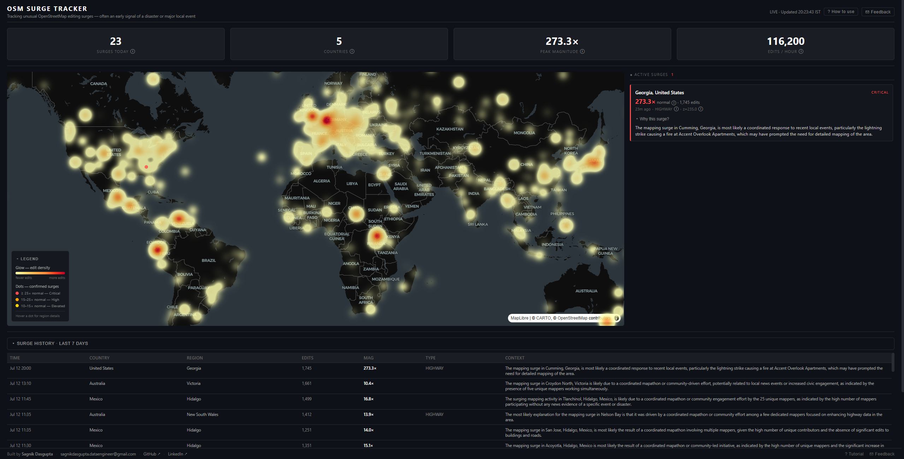
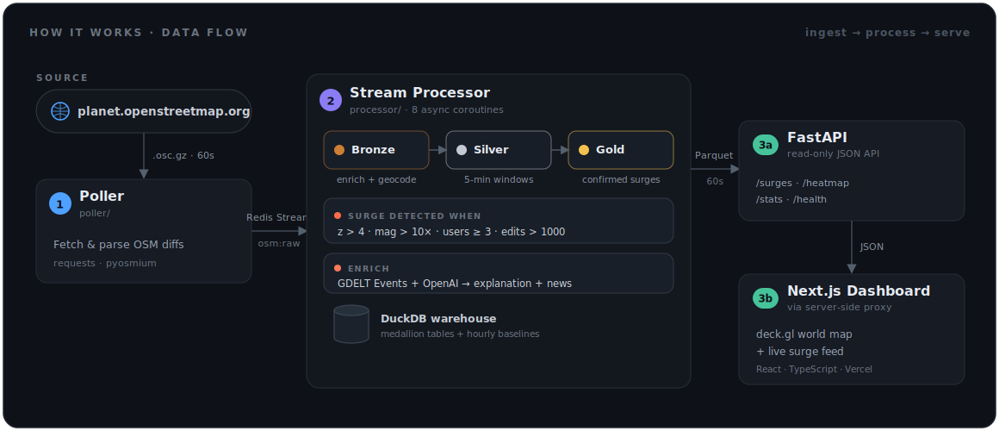

# 🌍 OSM Mapping Surge Tracker

**A real-time anomaly-detection system that watches OpenStreetMap edits worldwide and flags regions experiencing an unusual spike in mapping activity** — an early signal of a disaster, humanitarian response, or major local event.

When a flood hits Karnataka or an earthquake strikes Türkiye, volunteers flood OpenStreetMap with new buildings, roads, and hospitals within hours. This system detects that surge automatically — comparing each region's live edit volume against its own 7-day, hour-of-day baseline — and surfaces it on a live dashboard with an AI-generated explanation and related news headlines.

> Built by a data engineer as an end-to-end exercise in **streaming data architecture**: ingestion → stream processing → a Bronze/Silver/Gold medallion warehouse → a read API → a live dashboard.

---

## What it looks like



---

## How it works



| # | Component | Role |
|---|-----------|------|
| 1 | **Poller** (`poller/`) | Pulls OSM minutely diffs every 60 s, parses every edit, pushes raw events to a Redis Stream. |
| 2 | **Stream Processor** (`processor/`) | Eight `asyncio` coroutines: enrich + geocode → Bronze; 5-min windows → Silver; rolling baselines; z-score detection → Gold; AI explanation; Parquet export; hourly silver/gold archive to Azure Blob. |
| 3a | **FastAPI** (`api/`) | Thin read-only JSON API over the Gold/Silver data, plus a `/track` beacon that feeds an hourly visitor log to Azure Blob. |
| 3b | **Next.js** (`dashboard-web/`) | Dark "intelligence monitor" dashboard with a live deck.gl map and surge feed. Calls the API through its own server-side proxy. |

### The medallion warehouse (DuckDB)

| Layer | Table | Grain | Retention |
|-------|-------|-------|-----------|
| 🥉 Bronze | `bronze_raw_edits` | one row per OSM edit, geocoded | 3 days |
| 🥈 Silver | `silver_windowed_edits` | one row per region per 5-min window | 8 days |
| — | `baselines` | rolling 7-day avg/std per region × hour-of-day | rebuilt hourly |
| 🥇 Gold | `gold_surges` | one row per confirmed surge | kept |

### Surge detection

A region is flagged only when **all** conditions hold simultaneously (tuned to suppress false positives):

- `unique_users >= 3` — multiple independent mappers, not a single-account bulk import
- `z_score > 4.0` — statistically unusual vs. the region's baseline for that hour of day
- `surge_magnitude > 10.0` — at least 10× its normal edit volume
- `edit_count > 1000` — enough absolute volume to matter

A cold-start fallback (before baselines exist) flags regions exceeding **2× the global 95th percentile** (with the same `edit_count`, `surge_magnitude`, and `unique_users` floors).

---

## Tech stack

| Concern | Choice |
|---|---|
| Language | Python 3.13 |
| Ingestion | `requests`, `pyosmium`, Redis Streams |
| Stream processing | `asyncio`, `reverse_geocoder` |
| Warehouse | **DuckDB** (embedded OLAP) + Parquet |
| Enrichment | GDELT Cloud Events API + OpenAI (`gpt-4o-mini`) |
| API | **FastAPI** + Uvicorn + Pydantic v2 |
| Dashboard | **Next.js** (React, TypeScript) + **deck.gl** + **MapLibre** (token-free Carto dark basemap) |
| Hosting | Azure B1ms VM (1–3a) · Vercel (3b) |

---

## Repository layout

```
src/
├── poller/         Component 1 — OSM ingestion
├── processor/      Component 2 — stream processing + warehouse + snapshots
│   ├── snapshot.py      exports Parquet for the API (the serving bridge)
│   ├── blob_uploader.py hourly silver/gold archive → Azure Blob (optional)
│   └── timeutil.py      IST timezone helpers (now_ist)
├── api/            Component 3a — FastAPI read API
│   ├── main.py · db.py · models.py · timeutil.py · routes/{surges,heatmap,stats,track}.py
│   └── visitors.py · blob_storage.py  hourly visitor log → Azure Blob (optional)
├── dashboard-web/  Component 3b — Next.js dashboard (React + deck.gl)
│   ├── app/{layout,page}.tsx · app/api/osm/[...path]/route.ts (server-side proxy)
│   ├── app/api/track/route.ts  visitor beacon proxy (forwards real client IP)
│   ├── components/{Header,SurgeFeed,SurgeCard,HistoryTable,SurgeMap}.tsx
│   └── lib/{api,config,countries,time}.ts
├── requirements.txt  combined install manifest (all components)
├── secret.env        optional keys/config (auto-loaded via python-dotenv)
├── ARCHITECTURE.md   deep dive into every module and data flow
├── RUNNING_LOCALLY.md  step-by-step local setup + troubleshooting
├── DEPLOYMENT.md     cost-efficient public deployment recipe
└── README.md         (this file)
```

---

## Quick start

**Prerequisites:** Python 3.13, a running Redis instance, and Node.js 18+ (for the
dashboard, Component 3b).

```bash
# from src/, activate the shared venv
source osm/bin/activate              # Windows: .\osm\Scripts\activate

# one combined manifest installs everything
pip install -r requirements.txt
```

Optionally copy/fill `secret.env` (`GDELT_API_KEY`, `OPENAI_API_KEY` — both optional;
without them, surges are still recorded, just with no news/explanation). Every
component auto-loads `secret.env`, so no manual environment exports are needed.

Run each component in its own terminal:

```bash
# 1. Poller
cd poller && python poller.py

# 2. Processor (also writes data/api/*.parquet every 60s)
cd processor && python processor.py

# 3a. API — run from src/ so `api` imports as a package
python -m api.main                   # → http://localhost:8000

# 3b. Dashboard (Node.js — first time: npm install)
cd dashboard-web && npm install && npm run dev  # → http://localhost:3000
```

The dashboard's server-side proxy points at the API via `API_BASE_URL`
(defaults to `http://localhost:8000`). To override locally:

```bash
cd dashboard-web && echo "API_BASE_URL=http://localhost:8000" > .env.local
```

📖 **Step-by-step:** [RUNNING_LOCALLY.md](RUNNING_LOCALLY.md) (expected logs, timing,
troubleshooting).

### Optional environment variables

| Variable | Component | Default | Purpose |
|---|---|---|---|
| `REDIS_HOST` / `REDIS_PORT` | poller, processor | `localhost` / `6379` | Redis location |
| `PROCESSOR_START_ID` | processor | `$` | `$` = new messages only; `0` = replay backlog |
| `GDELT_API_KEY` | processor | — | enables news via GDELT Cloud Events API (optional) |
| `OPENAI_API_KEY` | processor | — | enables AI explanations (optional) |
| `API_PARQUET_DIR` | api | `<repo>/data/api` | where to read Parquet snapshots |
| `AZURE_STORAGE_CONNECTION_STRING` | processor, api | — | enables the silver/gold archive + hourly visitor log (optional) |
| `AZURE_BLOB_CONTAINER` | processor, api | — | target blob container for the archive + visitor log (optional) |
| `API_BASE_URL` | dashboard | `http://localhost:8000` | API location (read by the dashboard's server-side proxy) |

---

## API reference

Base URL: `http://<host>:8000`

| Method | Path | Description |
|---|---|---|
| `GET` | `/health` | Liveness probe → `{status, timestamp}` |
| `GET` | `/surges/active` | Active surges in the last 2 h, strongest first |
| `GET` | `/surges/history` | Historical surges. Params: `days` (≤90), `country_code`, `min_magnitude`, `limit` (≤1000) |
| `GET` | `/heatmap` | Per-region edit density, last 24 h |
| `GET` | `/stats` | Header summary: surges today, countries, peak magnitude, edits/hr |
| `POST` | `/track` | Visitor beacon (fired by the dashboard); records IP + user-agent for the hourly visitor log → 204 |

```bash
curl http://localhost:8000/surges/active
curl "http://localhost:8000/surges/history?days=7&min_magnitude=5.0&country_code=IN"
```

All endpoints return empty lists/objects rather than errors on missing data, so clients never have to handle 500s for an empty warehouse.

---

## Design notes worth knowing

**Why Parquet snapshots between the processor and the API?**
DuckDB allows only one process to hold a database file open read-write. The processor keeps that lock for life, so the API (a separate process) cannot open the same file — *not even read-only*. The processor therefore exports the API's tables to Parquet every 60 s, and the API queries those files through its own in-memory DuckDB connection: no lock contention, multiple readers, always fresh. See [`ARCHITECTURE.md`](ARCHITECTURE.md) for the full reasoning.

**Resilience.** Every long-running loop is wrapped in `while True: try/except`, so a transient failure restarts one coroutine without taking down the rest. Redis consumer groups give at-least-once delivery (messages are ACKed only after a confirmed DuckDB write). The CPU-bound geocoder runs via `asyncio.to_thread` so it can't stall the event loop, and the explainer caps concurrent GDELT/OpenAI calls with a semaphore so a surge burst can't self-DoS into timeouts. The dashboard degrades gracefully — an unreachable API shows a banner, not a stack trace.

**Timezone (IST).** Every timestamp stored in DuckDB is a naive datetime in **IST (UTC+5:30)** wall-clock, written via `now_ist()` so it's correct regardless of host timezone. Filters compare against an IST "now", and the API serialises with the `+05:30` offset so the dashboard shows correct local times. (The raw OSM edit timestamp stays UTC — it's authoritative upstream data.)

**Cloud archive & visitor logging (optional, Azure Blob).** Set `AZURE_STORAGE_CONNECTION_STRING` + `AZURE_BLOB_CONTAINER` and two extra writers switch on, both best-effort and disabled when unset. The processor archives the silver and gold layers hourly as a time-partitioned history (`silver/dt=YYYY-MM-DD/HH.parquet`, `gold/dt=…`), and the API flushes one JSON summary line per hour to `logs/visits-YYYY-MM-DD.log` — `unique_visitors` (distinct IPs) for "how many people", plus each visitor's IP + user-agent. The dashboard fires a one-shot beacon per page load and its proxy forwards the **real** client IP via `X-Forwarded-For`; without a login, IP + user-agent is the most identity that can be captured. Azure credentials live only on the VM, never on Vercel.

**Security posture.** The API serves public, read-only data; all user-supplied query parameters are bound (`?`) and clamped by FastAPI validation — never string-interpolated into SQL. No secrets are hardcoded (GDELT/OpenAI keys come from the environment). Because the API runs without a reverse proxy, access is gated in-app: a central middleware (`api/auth.py`) requires the shared `TRACK_SECRET` (sent by the dashboard proxy as `x-track-secret`) on **every** endpoint except `/health`, so the API is reachable only through the dashboard proxy — a client hitting `:8000` directly is refused with a 404. `POST /track` is additionally rate-limited (60/min per IP). Setting `TRACK_SECRET` locks the API down; leaving it unset opens all endpoints for local dev. This open state is **fail-closed in production**: with `APP_ENV=production` the API refuses to start unless `TRACK_SECRET` is set (it raises before uvicorn binds), so a public deployment can never come up with the gate silently disabled; `APP_ENV` defaults to `development`, where an open API is intentional. Optionally terminate TLS in uvicorn (see `DEPLOYMENT.md`) and restrict the VM port via the Azure NSG.

---

## Further reading

📐 **[ARCHITECTURE.md](ARCHITECTURE.md)** — a module-by-module walkthrough of every component, the exact data schemas (Redis Streams, DuckDB tables, Parquet snapshots), the serialization conventions, and the surge-detection math.
